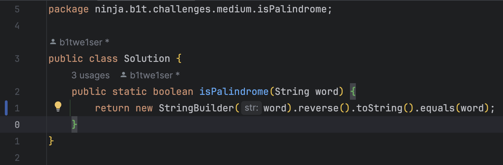
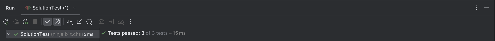

# Welcome to the Java challenges !

### Guide:

1. Read the challenges in `CodeChallenges.pdf` and pick one
2. Find the challenge in the folder `/src/ninja/b1t/challenges/medium`
3. Implement the method you picked in `Solution.java`
4. Run the test `SolutionTest.java` in the same folder
5. Pass the tests

## Example

1. We read and picked `2.4 isPalindrome`
2. Now we navigate to `/src/ninja/b1t/challenges/medium/isPlaindrome`
3. Now we implement the method
   
4. And now we test
   
5. It looks like we passed. 🎉

## Good luck and have fun!